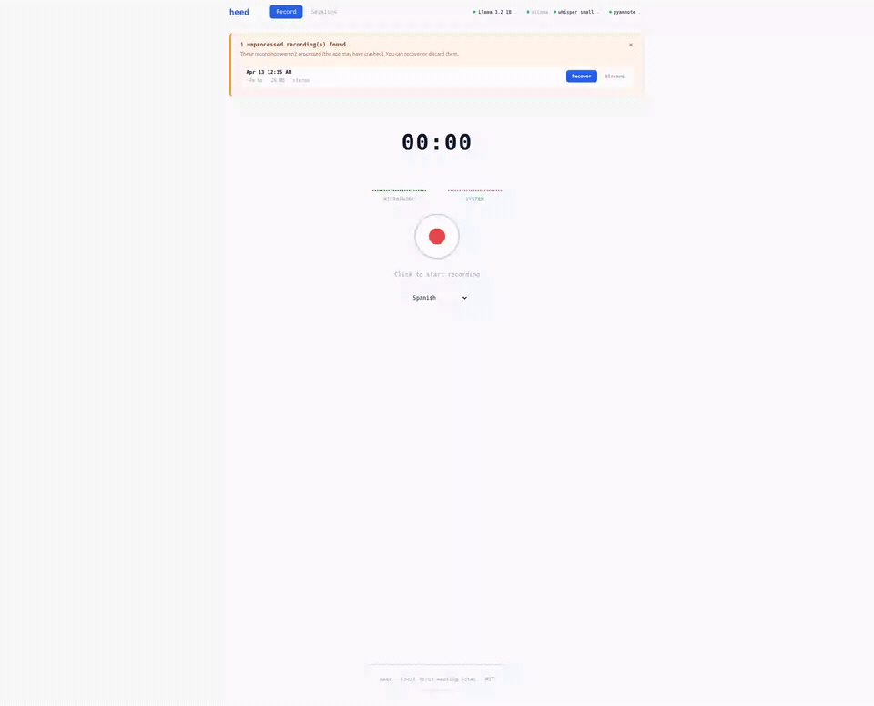

<p align="center">
  
  
  
</p>

<p align="center">
  
</p>

<p align="center">
  <strong>Every voice, even when they speak at once.</strong><br/>
  <em>Local. Open. Yours.</em>
</p>

<p align="center">
  Meeting transcription, diarization, and AI notes that run entirely on your Mac.<br/>
  Live while you record — and a full, higher-accuracy pass the moment you stop.<br/>
  Sits on top of Zoom, Meet, Teams, Discord. Your audio never leaves your machine. Ever.
</p>

---

<p align="center">
  
</p>

> *4 speakers. Identified by voice, not by login. Live transcription while you record, a full re-transcription when you stop. AI notes with one click. Everything processed on YOUR machine. $0/month.*

---

## Why heed exists

Your meeting audio is personal. It carries strategy calls, salary talks, client conversations, medical appointments. Almost every meeting tool today ships that audio to someone else's servers — and asks you to pay monthly for the privilege.

heed takes the opposite stance. Everything runs on your machine.

**If you work inside a company,** your meetings never touch a third-party server. That is the difference between "we transcribe internally" and "we uploaded a confidential roadmap discussion to a vendor's cloud." No processor to add to a DPA, no NDA to renegotiate, no client audio leaving your laptop. Compliance stops being a fight.

**If it's your own life,** the same guarantee, for free. A therapy session, a family call, a founder pitch, a lecture — the audio never leaves your disk, and there is no subscription. $0/month, forever, because there is no server to pay for.

What makes heed different:

- **Your audio stays on your disk.** ASR, diarization, and AI notes all run locally. No API keys, no subscriptions, nothing leaving your network.
- **Fast now, thorough after.** Live transcription appears while you record. When you stop, heed runs a second, higher-accuracy pass with real timestamps — so you get speed *and* a clean final transcript, not a tradeoff.
- **Speakers by voice, not by login.** heed identifies people by how they actually sound — and remembers them, so the same voice is recognized across future meetings.
- **It hears people talk over each other.** Mic and system audio are captured on separate channels, so heed catches overlapping speech that mono-mixing tools lose forever.
- **One command to install.** `npx create-heed`. No cmake, no CUDA SDK, no build gymnastics.

---

## How it's different

<table>
<tr>
<th></th>
<th align="center"><strong>heed</strong></th>
<th align="center">Meetily</th>
<th align="center">Granola</th>
<th align="center">Otter.ai</th>
<th align="center">Fathom</th>
</tr>
<tr>
<td><strong>100% local processing</strong></td>
<td align="center"><strong>Yes</strong></td>
<td align="center">Yes</td>
<td align="center">No (cloud AI)</td>
<td align="center">No (full SaaS)</td>
<td align="center">No (cloud)</td>
</tr>
<tr>
<td><strong>Apple Silicon engine</strong></td>
<td align="center"><strong>Parakeet + FluidAudio on the ANE</strong></td>
<td align="center">whisper.cpp</td>
<td align="center">Cloud</td>
<td align="center">Cloud</td>
<td align="center">Cloud</td>
</tr>
<tr>
<td><strong>Live + full post-stop pass</strong></td>
<td align="center"><strong>Both</strong></td>
<td align="center">Post-stop</td>
<td align="center">Live</td>
<td align="center">Live</td>
<td align="center">Post-stop</td>
</tr>
<tr>
<td><strong>Voice-based diarization</strong></td>
<td align="center"><strong>Yes</strong></td>
<td align="center">Basic</td>
<td align="center">Basic</td>
<td align="center">Cloud model</td>
<td align="center">By login name</td>
</tr>
<tr>
<td><strong>Voice memory (recognizes recurring speakers)</strong></td>
<td align="center"><strong>Yes</strong></td>
<td align="center">No</td>
<td align="center">No</td>
<td align="center">No</td>
<td align="center">No</td>
</tr>
<tr>
<td><strong>Overlap detection</strong></td>
<td align="center"><strong>Channel-based</strong></td>
<td align="center">No</td>
<td align="center">No</td>
<td align="center">No</td>
<td align="center">No</td>
</tr>
<tr>
<td><strong>One-command install</strong></td>
<td align="center"><strong>npx create-heed</strong></td>
<td align="center">Build from source on Linux</td>
<td align="center">App</td>
<td align="center">Web</td>
<td align="center">App</td>
</tr>
<tr>
<td><strong>Works over Zoom/Meet/Teams</strong></td>
<td align="center"><strong>Yes</strong></td>
<td align="center">Yes</td>
<td align="center">Yes</td>
<td align="center">Bot joins</td>
<td align="center">Yes</td>
</tr>
<tr>
<td><strong>Offline capable</strong></td>
<td align="center"><strong>Yes</strong></td>
<td align="center">Yes</td>
<td align="center">No</td>
<td align="center">No</td>
<td align="center">No</td>
</tr>
<tr>
<td><strong>Open source</strong></td>
<td align="center"><strong>MIT</strong></td>
<td align="center">MIT</td>
<td align="center">No</td>
<td align="center">No</td>
<td align="center">No</td>
</tr>
<tr>
<td><strong>Price</strong></td>
<td align="center"><strong>$0</strong></td>
<td align="center">$0</td>
<td align="center">$40/mo</td>
<td align="center">$17/mo</td>
<td align="center">$32/mo</td>
</tr>
</table>

---

## Install

One command. It detects your OS, checks dependencies, and installs everything:

```bash
npx create-heed
```

The installer is doctor-first — it inspects your machine, only downloads what's missing, and walks you through each step:

```
  heed — local-first meeting transcription

> Detected: macOS (Apple M3, 8 cores, Neural Engine)

[1/7] Bun runtime
✓ Bun 1.3.11 already installed

[2/7] Python 3.10+
✓ Python 3.12.3 found

[3/7] Apple Silicon engine (Parakeet + FluidAudio, runs on the Neural Engine)
! Building the native sidecar (first time only)
✓ heed-parakeet built

[4/7] ffmpeg (audio capture)
✓ ffmpeg already installed

[5/7] Ollama (local AI engine)
✓ Ollama 0.20.0 already installed

[6/7] Download heed
> Cloning from GitHub...
✓ Downloaded

[7/7] Launch heed
? Open as floating desktop panel? (Y/n)
```

### Manual install

```bash
git clone https://github.com/isjunrod/heed.git
cd heed
bun install
bun run dev
# Open http://localhost:5170
```

**Requirements:** Bun, Python 3.10+, ffmpeg, Ollama, and system-audio capture — ScreenCaptureKit or BlackHole on macOS, PipeWire on Linux.

---

## Update

From anywhere:

```bash
npx create-heed update
```

Only downloads what changed. Auto-reinstalls dependencies if needed.

---

## How it works

heed captures two audio streams — your mic and the system output — on **separate channels**, and keeps them separate all the way through. That single decision is what lets heed detect overlapping speech that other tools mix to mono and lose.

**On Apple Silicon (the fast path):**

```
Your mic ──┐
           ├── ffmpeg (stereo) ──► dual-capture.wav
System ────┘         │
                     ▼
          ┌──────────┴───────────┐
          │  LIVE (while you talk)│   Parakeet streaming + Sortformer
          │  → text + speakers    │   diarization, on the Neural Engine
          └──────────┬───────────┘
                     │  ── you press stop ──
                     ▼
          ┌──────────┴───────────┐
          │  POST-STOP (full pass)│   Parakeet re-transcribes with real
          │  → timestamps         │   timestamps; FluidAudio embeds every
          │  → voice clustering   │   segment; heed re-clusters by cosine
          │  → speaker embeddings │   → separates and remembers each voice
          └──────────┬───────────┘
                     ▼
            Speakers + AI Notes
```

The whole ASR + diarization engine runs on the **Apple Neural Engine** through a native Swift/CoreML sidecar built on [FluidAudio](https://github.com/FluidInference/FluidAudio) — **zero CUDA, zero cloud.** ASR (Parakeet TDT v3) and diarization run as separate resident processes so the diarizer never blocks the transcriber. On Apple Silicon, FluidAudio benchmarks the Parakeet models at up to ~140x real-time — roughly an hour of audio processed in the time it takes to read this sentence.

The post-stop pass is where the accuracy lives: heed re-transcribes the recording with per-token timestamps, extracts a per-segment voice embedding (WeSpeaker v2, 256-dim), and **re-clusters by cosine similarity** — pulling apart speakers a single-pass diarizer would merge. Each speaker's embedding is stored, which is what powers voice memory across meetings.

**On Linux / NVIDIA:** the same pipeline runs on [faster-whisper](https://github.com/SYSTRAN/faster-whisper) (CTranslate2, CUDA fp16 — or int8 on CPU) with [pyannote 3.1](https://github.com/pyannote/pyannote-audio) for diarization. Fully supported and actively evolving.

---

## Key features

**Live and post-stop transcription** — Text streams in real time while you record, so you never wait for the meeting to end to know what was said. The moment you stop, heed runs a full, higher-accuracy re-transcription with real timestamps. Fast when you need it, thorough when it counts.

**Voice memory** — Rename a speaker once. heed saves their voice embedding and recognizes them automatically in every future meeting. No training, no enrollment. It just remembers — a private "voice RAG" that lives only on your machine.

**Overlap detection** — Two people talking at once? heed catches it. Because mic and system audio live in separate channels, it knows exactly when voices collide — information every mono-mixing tool destroys before it ever reaches the model.

**AI notes, adaptive to your hardware** — On first launch heed reads your GPU, VRAM, CPU, and RAM, then recommends AI models that actually fit your machine. You pick the one you want; it downloads in-app with one click and runs locally through Ollama. Choose a note template — general summary, 1-on-1, standup, interview, brainstorm, customer call, or your own — and get structured notes from the same transcript.

**Floating panel** — A small always-on-top window that floats over your Zoom or Meet call. Hit **Float** in the app (or launch straight into it from `npx create-heed`) and record without leaving your meeting.

**Smart auto-titles** — "Q3 Revenue Review with Sarah and Marcus" instead of "Meeting Apr 12, 2026". Generated locally from the transcript content, in whatever language was spoken.

**Offline capable** — Once set up, no internet required. Record on a plane, transcribe on a train.

<details>
<summary><strong>All features</strong></summary>

<br/>

- **Smart rename = merge** — Rename "Speaker 2" to "Sarah Chen". If she already exists, heed merges them automatically. No duplicates.
- **Inline `#tag` autocomplete** — Type `#` in the session title to organize by project, client, or topic.
- **Meeting auto-detector** — Detects Zoom, Meet, Teams, or Discord running and prompts you to record.
- **Auto-recovery** — Crashed mid-recording? Audio is safe on disk. One click to recover on next launch.
- **Hardware-aware scaling** — heed measures your machine and targets ~70–80% of it, leaving headroom so your laptop doesn't freeze with a dozen windows open.
- **Works with everything** — Zoom, Meet, Teams, Discord, YouTube, podcasts. If it plays audio, heed captures it. Nobody in the call needs to install a thing.
- **Bilingual** — Setup wizard and in-app tour in English and Spanish, auto-detected from your system.
- **Graceful fallbacks** — If the native sidecar isn't built, macOS falls back to MLX-Whisper; if system capture is denied, it falls back to BlackHole. No dead ends.
- **VRAM discipline (Linux/CUDA)** — Forces Ollama to release GPU memory right after generating notes so diarization doesn't get starved. Auto-retries on RAM exhaustion.

</details>

---

## Stack

```
packages/
├── client/         Vite + React 19 + TypeScript + Zustand + CSS Modules
├── server/         Bun (HTTP, SSE, ffmpeg orchestration, Ollama proxy)
├── transcription/  Python (engine router: Parakeet on Mac, faster-whisper on Linux/CPU)
│   └── native/
│       └── heed-parakeet/   Swift sidecar — Parakeet TDT v3 + FluidAudio
│                            (CoreML on the Apple Neural Engine) + heed-syscap
│                            (ScreenCaptureKit system-audio capture)
├── shared/types/   TypeScript interfaces (client ↔ server)
├── desktop/        Chrome --app launcher (floating panel)
└── cli/            npx create-heed installer
```

---

## Compatibility

| | macOS | Linux | Windows |
|---|---|---|---|
| **Status** | **First-class** | **Supported & evolving** | Coming soon |
| ASR + diarization | Parakeet + FluidAudio on the ANE | faster-whisper + pyannote 3.1 | — |
| Audio capture | ScreenCaptureKit / BlackHole + avfoundation | PipeWire | — |
| Acceleration | Apple Neural Engine + Metal | CUDA (NVIDIA) / CPU | — |
| Desktop panel | Chrome --app | Chrome --app | — |

---

## Commands

```bash
bun run dev              # Start all services (server + client + python)
bun run build            # Build frontend for production
bun run desktop          # Open floating desktop panel
npx create-heed          # First-time install
npx create-heed update   # Update from anywhere
```

---

## Roadmap

heed ships continuously on **both** macOS and Linux.

- [ ] Export to Markdown / Obsidian / Notion
- [ ] Session search across all meetings
- [ ] Keyboard shortcut for global record toggle
- [ ] Weekly meeting digest, generated locally
- [ ] Google Calendar integration
- [ ] Linux: bring live streaming diarization and voice-clustering to parity with the Mac engine
- [ ] Windows support (WASAPI loopback)

---

## For Meetily users

If you love the idea of local, open-source meeting notes, you'll feel at home here.

Meetily is a great project, and on macOS and Windows it's first-class. On Linux, though, it's build-from-source — you install the CUDA/ROCm/Vulkan SDKs, run cmake, and hope it links. heed's whole install story is one line: `npx create-heed`, no SDK, no cmake, no build gymnastics, on either OS.

Once you're in, heed adds a few things you may have been missing: it recognizes recurring speakers by voice across meetings, detects when two people talk over each other, and — on Apple Silicon — runs its entire ASR + diarization engine on the Neural Engine at up to ~140x real-time. Same local-first principle, less friction, more signal.

---

## Contributing

PRs welcome. The codebase is clean and typed. Start with `bun run dev` and explore the `packages/` structure.

---

## License

[MIT](LICENSE) — free to use, modify, and distribute.

---

## Acknowledgments

Inspired by [trx](https://github.com/crafter-station/trx) by [CrafterStation](https://www.crafterstation.com/). Apple Silicon inference is powered by [FluidAudio](https://github.com/FluidInference/FluidAudio).

---

<p align="center">
  <em>Built for the people who believe their conversations belong to them.</em>
</p>
