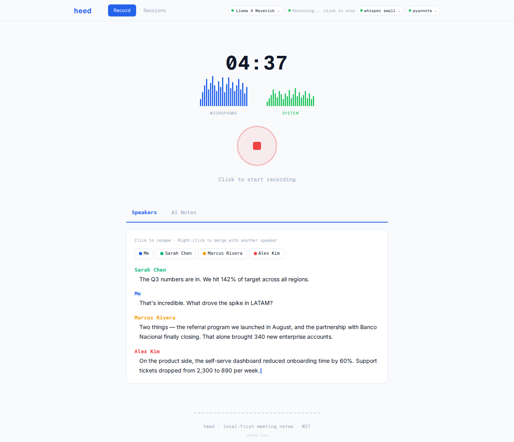

<p align="center">
  
  
  
</p>

<p align="center">
  
</p>

<p align="center">
  <strong>Every voice, even when they speak at once.</strong><br/>
  <em>Local. Open. Yours.</em>
</p>

<p align="center">
  Self-hosted meeting transcription with real speaker diarization.<br/>
  Runs on top of Zoom, Meet, Teams, Discord — without anyone knowing.<br/>
  Your audio never leaves your machine. Ever.
</p>

---

<p align="center">
  
</p>

> *4 speakers. Identified by voice, not by login. Live transcription while recording. AI notes with one click. Everything processed by YOUR GPU. $0/month.*

---

## Why heed exists

Your meeting audio is personal. It contains strategy discussions, salary negotiations, client calls, medical appointments. Today, every meeting tool sends that audio to someone else's servers.

**Granola** charges $40/month and only works on macOS. **Otter** and **Fireflies** send your audio to the cloud. **Meetily** promised open-source local transcription but [doesn't compile on most Linux distros](https://github.com/meetily/meetily/issues). **Fathom** is macOS-only and cloud-dependent.

heed is different:

- **Your audio stays on your disk.** Whisper, pyannote, and Ollama run on your machine. No API keys. No subscriptions. No data leaving your network.
- **Works with everything.** Zoom, Google Meet, Teams, Discord, a YouTube video — if it plays on your computer, heed captures it. Nobody in the call needs to install anything.
- **Real speaker diarization.** Not "Speaker 1, Speaker 2" assigned by login. Actual voice analysis that identifies people by how they sound — and remembers them next time.

---

## How it's different

<table>
<tr>
<th></th>
<th align="center"><strong>heed</strong></th>
<th align="center">Granola</th>
<th align="center">Otter.ai</th>
<th align="center">Fathom</th>
<th align="center">Others</th>
</tr>
<tr>
<td><strong>100% local processing</strong></td>
<td align="center">Yes</td>
<td align="center">No (cloud AI)</td>
<td align="center">No (full SaaS)</td>
<td align="center">No (cloud)</td>
<td align="center">No (cloud)</td>
</tr>
<tr>
<td><strong>Linux support</strong></td>
<td align="center"><strong>Native</strong></td>
<td align="center">No</td>
<td align="center">Web only</td>
<td align="center">No</td>
<td align="center">Web only</td>
</tr>
<tr>
<td><strong>macOS support</strong></td>
<td align="center">Yes</td>
<td align="center">Yes</td>
<td align="center">Web</td>
<td align="center">Yes</td>
<td align="center">Web</td>
</tr>
<tr>
<td><strong>Voice-based diarization</strong></td>
<td align="center"><strong>pyannote 3.1</strong></td>
<td align="center">Basic</td>
<td align="center">Cloud model</td>
<td align="center">Cloud model</td>
<td align="center">By login name</td>
</tr>
<tr>
<td><strong>Voice memory</strong></td>
<td align="center"><strong>Yes</strong></td>
<td align="center">No</td>
<td align="center">No</td>
<td align="center">No</td>
<td align="center">No</td>
</tr>
<tr>
<td><strong>Overlap detection</strong></td>
<td align="center"><strong>Channel-based</strong></td>
<td align="center">No</td>
<td align="center">No</td>
<td align="center">No</td>
<td align="center">No</td>
</tr>
<tr>
<td><strong>Works with Zoom/Meet/Teams</strong></td>
<td align="center">Yes</td>
<td align="center">Yes</td>
<td align="center">Bot joins</td>
<td align="center">Yes</td>
<td align="center">Must use their platform</td>
</tr>
<tr>
<td><strong>Offline capable</strong></td>
<td align="center"><strong>Yes</strong></td>
<td align="center">No</td>
<td align="center">No</td>
<td align="center">No</td>
<td align="center">No</td>
</tr>
<tr>
<td><strong>Open source</strong></td>
<td align="center"><strong>MIT</strong></td>
<td align="center">No</td>
<td align="center">No</td>
<td align="center">No</td>
<td align="center">Partial</td>
</tr>
<tr>
<td><strong>Price</strong></td>
<td align="center"><strong>$0</strong></td>
<td align="center">$40/mo</td>
<td align="center">$17/mo</td>
<td align="center">$32/mo</td>
<td align="center">Free (broken)</td>
</tr>
</table>

---

## Install

One command. It detects your OS, checks dependencies, and installs everything:

```bash
npx create-heed
```

The installer walks you through each step:

```
  heed — local-first meeting transcription

> Detected: Linux (AMD Ryzen 5 5600X)

[1/7] Bun runtime
✓ Bun 1.3.11 already installed

[2/7] Python 3.10+
✓ Python 3.12.3 found

[3/7] AI models (faster-whisper + pyannote)
! Installing AI packages (~3GB download first time)
? Install faster-whisper + pyannote-audio + torch? (Y/n) y
✓ AI packages installed

[4/7] ffmpeg (audio capture)
✓ ffmpeg already installed

[5/7] Ollama (local AI engine)
✓ Ollama 0.20.0 already installed

[6/7] Download heed
> Cloning from GitHub...
✓ Downloaded

[7/7] Launch heed
? Open as floating desktop panel? (Y/n)
```

### Manual install

```bash
git clone https://github.com/isjunrod/heed.git
cd heed
bun install
bun run dev
# Open http://localhost:5000
```

**Requirements:** Bun, Python 3.10+, ffmpeg, Ollama, and one of: PipeWire (Linux) or BlackHole (macOS) for system audio capture.

---

## Update

From anywhere:

```bash
npx create-heed update
```

Only downloads what changed. Auto-reinstalls dependencies if needed.

---

## How it works

```
Your mic ──┐
           ├── ffmpeg (stereo) ──► dual-capture.wav
System ────┘                              │
                                          ▼
                           Split L (mic) / R (system)
                                    │           │
                              Whisper(mic)  Whisper(sys)
                              label "Me"    + pyannote(sys)
                                    │           │
                                    └─► merge timelines
                                            │
                                    detect overlaps (≥300ms)
                                            │
                                    Speakers + AI Notes
```

**Channel-based diarization.** Mic and system audio are captured as separate stereo channels. Whisper transcribes each independently. pyannote runs speaker diarization only on the system channel (your mic is always you). Timelines are merged and overlaps are flagged when two people spoke simultaneously.

This is why heed detects overlapping voices that other tools miss — they mix everything to mono before processing, destroying the spatial information.

---

## Key features

**Live transcription** — Text appears in real-time as you record. You don't wait until the meeting ends to know what was said. Speakers are identified progressively while you're still talking.

**Overlap detection** — Two people talking at once? heed catches it. Because mic and system audio live in separate channels, it knows exactly when voices collide. Every other tool mixes to mono first and loses this information forever.

**Voice memory** — Rename a speaker once. heed saves their voice embedding and recognizes them automatically in every future meeting. No training, no setup. It just remembers.

**Hardware-aware model picker** — On first launch, heed reads your GPU, VRAM, CPU, and RAM. Then it recommends the best AI model that actually fits your machine. 14 models from Llama, Qwen, Gemma families. Download in-app, one click, no terminal needed.

**Smart auto-titles** — "Q3 Revenue Review with Sarah and Marcus" instead of "Meeting Apr 12, 2026". Ollama generates a real title from the transcript content, in whatever language was spoken.

**Note templates** — Choose a prompt template before generating notes: general summary, sales call, 1-on-1, retrospective, or write your own. Same transcript, different output depending on what you need.

<details>
<summary><strong>All features</strong></summary>

<br/>

**Smart rename = merge** — Rename "Speaker 2" to "Sarah Chen". If Sarah already exists from a previous identification, heed merges them automatically. No duplicate chips, no manual cleanup. Right-click still works for explicit merges.

**Inline `#tag` autocomplete** — Type `#` in the session title and get tag suggestions. Organize sessions by project, client, or topic without leaving the recording screen.

**Meeting auto-detector** — heed listens to your system's audio stack (PipeWire on Linux) and detects when Zoom, Meet, Teams, or Discord are active. It can prompt you to start recording automatically when a meeting begins.

**VRAM intelligence** — When Ollama generates notes, it holds your GPU's memory hostage. heed forces `keep_alive: 0` so the model unloads immediately after generation, freeing VRAM for pyannote's next diarization pass. On 4GB GPUs, this is the difference between working and crashing.

**Auto-recovery** — heed crashed mid-recording? Your audio is safe on disk. On next launch, one click recovers the session and transcribes everything. Nothing is lost.

**GPU/CPU split** — heed auto-detects your free VRAM and splits work intelligently. Less than 1.5GB free: everything on CPU. 1.5-6GB: pyannote on GPU, whisper on CPU. 6GB+: both on GPU. No manual configuration.

**Offline capable** — No internet connection needed after initial setup. All models run locally. Record a meeting on a plane, transcribe it on a train.

**Works with everything** — Zoom, Google Meet, Teams, Discord, a YouTube video, a podcast, a voice memo. If audio plays on your computer, heed captures it. Nobody in the call installs anything, nobody knows you're recording.

**Bilingual setup wizard** — First-time users get a guided 3-step setup (Ollama, ffmpeg, AI model) in English or Spanish. The app detects your system language automatically.

**In-app tour** — 5-step interactive walkthrough for new users. Spotlight-style highlights, contextual explanations. Skippable, never shown again.

**GPU/CPU transparency** — If your selected model doesn't fit in VRAM, heed tells you exactly why and offers CPU mode. No silent crashes, no cryptic CUDA errors. You always know what's running and where.

**Ollama auto-retry** — If the AI model crashes from RAM exhaustion (it happens), heed waits 3 seconds and retries automatically. You see notes, not error messages.

</details>

---

## Stack

```
packages/
├── client/         Vite + React 19 + TypeScript + Zustand + CSS Modules
├── server/         Bun (HTTP, SSE, ffmpeg orchestration, Ollama proxy)
├── transcription/  Python (faster-whisper + pyannote 3.1)
├── shared/types/   TypeScript interfaces (client ↔ server)
├── desktop/        Chrome --app launcher (floating panel)
└── cli/            npx create-heed installer
```

---

## Compatibility

| | Linux | macOS | Windows |
|---|---|---|---|
| **Status** | **Fully supported** | **Supported** | Coming soon |
| Audio capture | PipeWire | BlackHole + avfoundation | — |
| GPU acceleration | CUDA (NVIDIA) | MPS (Apple Silicon) | — |
| Desktop panel | Chrome --app | Chrome --app | — |

---

## Commands

```bash
bun run dev              # Start all services (server + client + python)
bun run build            # Build frontend for production
bun run desktop          # Open floating desktop panel
npx create-heed          # First-time install
npx create-heed update   # Update from anywhere
```

---

## Roadmap

- [ ] Real-time streaming transcription during recording (partial — live preview active)
- [ ] Export to Markdown / Obsidian / Notion
- [ ] Session search across all meetings
- [ ] Keyboard shortcut for global record toggle
- [ ] Weekly meeting digest via Ollama
- [ ] Google Calendar integration
- [ ] Windows support (WASAPI loopback)

---

## For Meetily users

If you're here because Meetily didn't compile on your Linux distro — welcome. heed was built specifically to fill that gap. No Electron. No broken deps. No cmake nightmares. Just `npx create-heed` and you're running in 2 minutes.

---

## Contributing

PRs welcome. The codebase is clean and typed. Start with `bun run dev` and explore the `packages/` structure.

---

## License

[MIT](LICENSE) — free to use, modify, and distribute.

---

## Acknowledgments

Inspired by [trx](https://github.com/crafter-station/trx) by CrafterStation.

---

<p align="center">
  <em>Built for the people who believe their conversations belong to them.</em>
</p>
